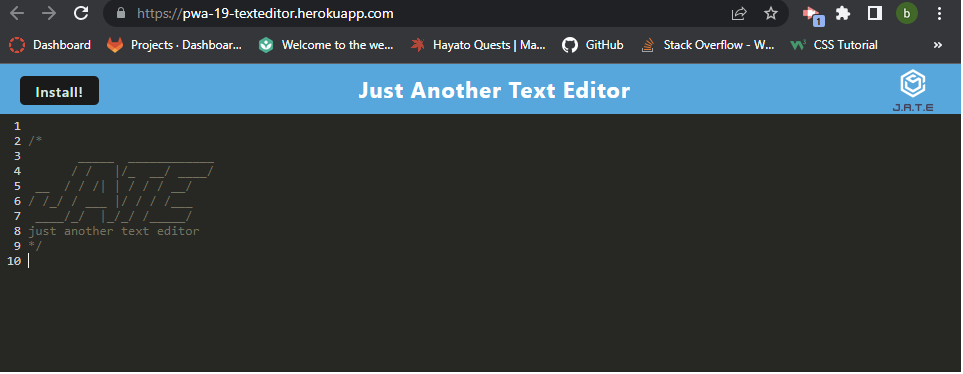
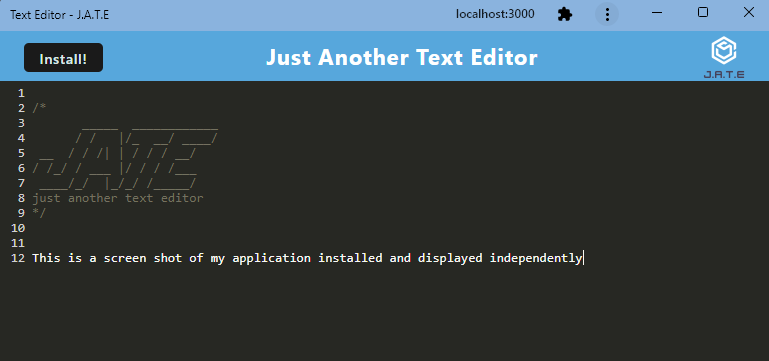

# 19-PWA_TextEditor

## User Story

```md
AS A developer
I WANT to create notes or code snippets with or without an internet connection
SO THAT I can reliably retrieve them for later use
```

## Acceptance Criteria

```md
GIVEN a text editor web application
WHEN I open my application in my editor
THEN I should see a client server folder structure
WHEN I run `npm run start` from the root directory
THEN I find that my application should start up the backend and serve the client
WHEN I run the text editor application from my terminal
THEN I find that my JavaScript files have been bundled using webpack
WHEN I run my webpack plugins
THEN I find that I have a generated HTML file, service worker, and a manifest file
WHEN I use next-gen JavaScript in my application
THEN I find that the text editor still functions in the browser without errors
WHEN I open the text editor
THEN I find that IndexedDB has immediately created a database storage
WHEN I enter content and subsequently click off of the DOM window
THEN I find that the content in the text editor has been saved with IndexedDB
WHEN I reopen the text editor after closing it
THEN I find that the content in the text editor has been retrieved from our IndexedDB
WHEN I click on the Install button
THEN I download my web application as an icon on my desktop
WHEN I load my web application
THEN I should have a registered service worker using workbox
WHEN I register a service worker
THEN I should have my static assets pre cached upon loading along with subsequent pages and static assets
WHEN I deploy to Heroku
THEN I should have proper build scripts for a webpack application
```

## Installation

*What are the steps required to install your project? Provide a step-by-step description of how to get the development environment running.*

Download all of the files from the repo. Then from your terminal run 'npm i' to install the packages associated with this project. 

To run the application locally, after you have downloaded the files and completed the installation step above. From your terminal you will want to run 'npm start' to start the server, and then go to localhost:3000. 

If you have plans to install on local machine, go ahead and proceed with clicking install button once app is fully deployed.

Link to live application is deployed to Heroku and is available [here.](https://pwa-19-texteditor.herokuapp.com/)

## Screenshot




## Contributing
***
Myself, Bryan S. & UW coding bootcamp for codebase.


## Questions
***
https://github.com/bsayavong

If you have any further questions please reach out to my email -

bksayavong@gmail.com